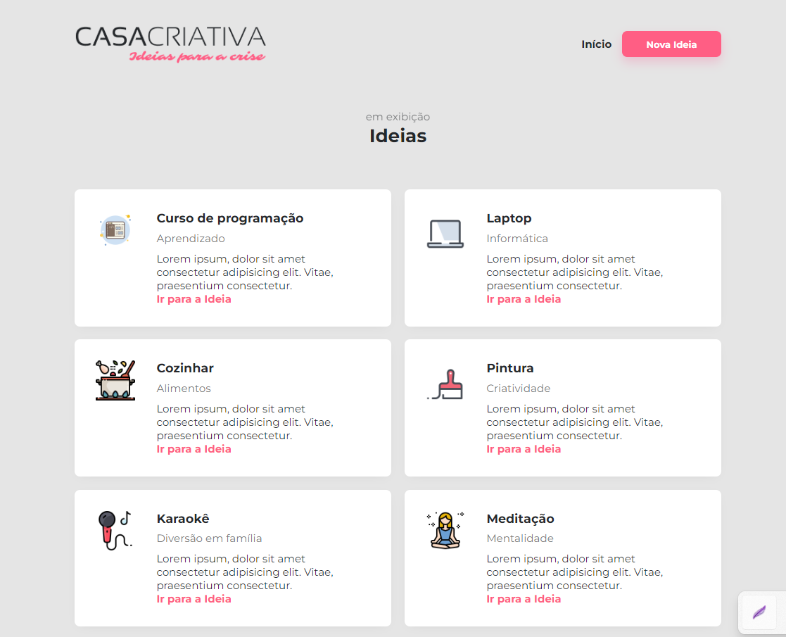

<h1 align="center" style="color: #ff5e84; font-weight: 700;"> Casa Criativa </h1>

## 💻 Tela de Ideias



O Projeto Casa Criativa é um site para adicionar ideias para realizar em casa, cozinhar, assistir cursos, etc. A RocketSeat junto com a Potência Tech fizeram esse projeto e nos repassaram em forma de aulas, tive vários aprendizados em HTML, CSS, JS e Banco de dados.

## ✅ Como abrir o projeto?
Siga esses passos para abrir o projeto no seu computador (é necessário ter NODE NPM):

- Clone o repositório
```
git clone https://github.com/ericlbarreto/casa-criativa.git
```
- Instale as dependências
```
npm install
```
- Inicie o servidor
```
npm run dev
```
- Abra o site no seu navegador
```
localhost:3000
```

- ⚠️ Meu próximo passo será aprender a dar deploy nesses projetos com back-end e banco de dados para facilitar o acesso.

## 📚 New Learnings
- Desenvolvi mais a lógica do back-end, receber requisições e enviar respostas, além da lógica geral do CSS e HTML.
- Utilizei a biblioteca nunjucks que permite fatorar o código HTML, realizar laços de repetição e variáveis, além de minimizar a repetição de códigos em diferentes páginas, nos códigos ela é geralmente utilizada pela tag 
- Utilizei pela primeira vez um banco de dados (SQLITE3) para armazenar as ideias que o usuário cadastrar no site, armazenando dados como título, link da imagem, descrição... da ideia cadastrada.
